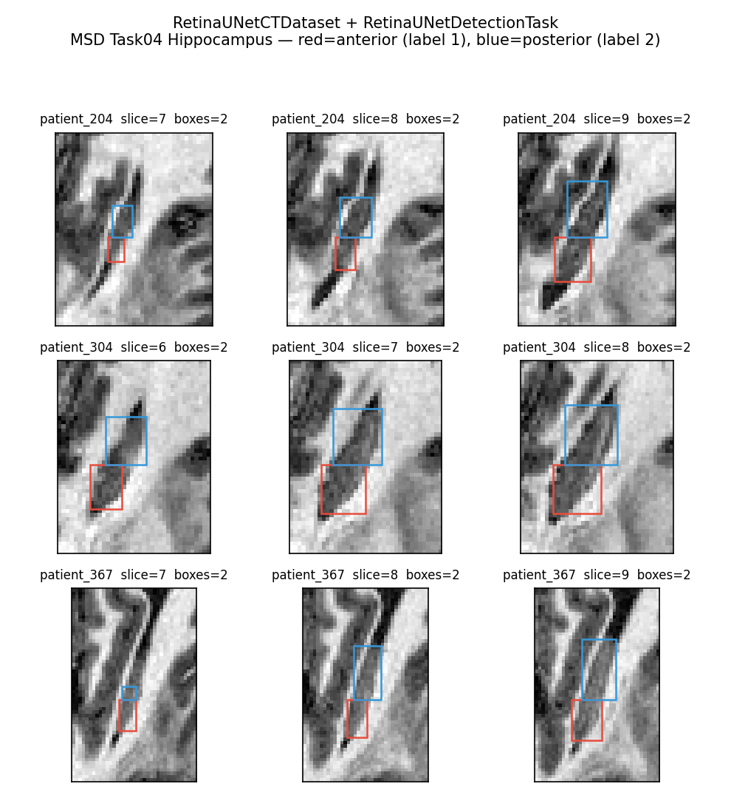
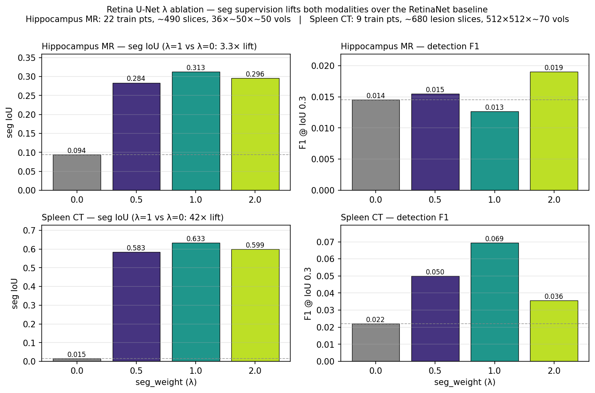
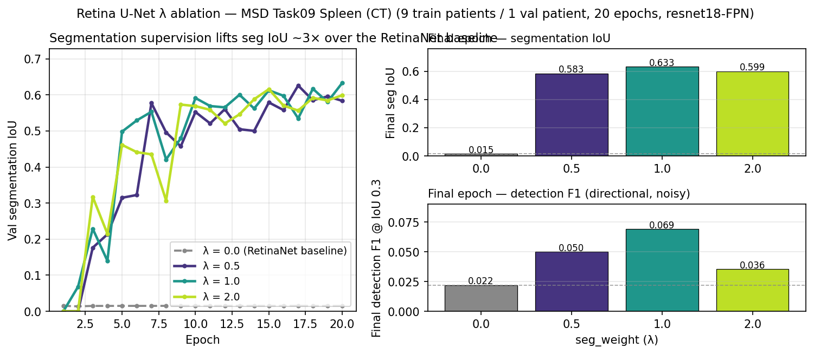

<!-- _class: lead -->
<!-- _paginate: false -->

# Reproducing Retina U-Net

## Medical Object Detection via Segmentation Supervision

**Jeffrey Chen** (jc182) · **Mark Chen** (mc2115)

CS598 DL4H — Spring 2026

Paper: Jaeger et al., 2018 · arxiv.org/abs/1811.08661

---

# The problem

Medical imaging often needs **object-level** outputs — find the tumor, draw a box around the nodule. Two common approaches each leave supervision on the table.

| Approach | ✅ Good at | ❌ Bad at |
|---|---|---|
| **Segmentation model** (U-Net) | Uses pixel-level masks | Needs hand-crafted post-processing to emit boxes (thresholding, connected components) |
| **Object detector** (RetinaNet) | Emits boxes directly | Ignores pixel masks entirely |

Medical datasets are **small** and pixel annotations are **expensive**.
Wasting supervision is the real cost.

> *Can we exploit both signals end-to-end in one model?*

---

# The method — *"embarrassingly simple"*

```
            Input image (CT / MR slice)
                      ↓
              ResNet backbone + FPN
                   ↙        ↘
        RetinaNet head    U-Net decoder
               ↓                ↓
         detection         pixel-wise
          boxes            seg. mask
```

**Joint training loss:** `L = L_cls + L_bbox + λ · L_seg`

- `L_cls`, `L_bbox` — standard RetinaNet (focal loss + smooth-L1)
- `L_seg` — per-pixel binary cross-entropy
- **Seg branch is training-time only** — inference returns detection boxes (+ mask, optional)

---

# Our reproduction — what we built

**PyHealth contribution** (branch `implementation1`):

- `pyhealth/datasets/RetinaUNetCTDataset` — CT volume loader, HU window, axial slicing
- `pyhealth/tasks/RetinaUNetDetectionTask` — mask → bounding-box extraction
- `pyhealth/models/RetinaUNet` — torchvision RetinaNet + pyramidal U-Net decoder on shared backbone (single forward pass via hook)
- `pyhealth/models/retina_unet_training.py` — train loop + AP/F1/seg-IoU metrics
- `examples/retina_unet_hippocampus_colab.ipynb` — one-click Colab
- `scripts/{download_data,run_ablation,run_tests}.sh`
- **54 unit tests**, all passing

**Upfront scope reduction**: **2D slice-wise**, not the paper's 3D patch-wise.
Cost disclosed — see last content slide.

---

# Datasets — three public, no LIDC credentialing



| Dataset | Modality | Train slices | Target size | Difficulty |
|---|---|---|---|---|
| **Hippocampus** (MSD Task04) | MR | ~490 | ~10 px substructure | Easy (large, recurrent) |
| **Spleen** (MSD Task09) | CT | ~680 | ~100+ px organ | Easy (big, high-contrast) |
| **LUNA16** (preprocessed) | CT | 400 | 5–25 px nodules | **Hard** — paper's regime |

Figure right: real GT-box overlays on the hippocampus data we trained on (red = anterior, blue = posterior).

---

<!-- _class: big-figure -->

# Main result — claim reproduces on all three datasets



**Seg IoU**: λ > 0 lifts every dataset over RetinaNet baseline (3.3× / 50× / 12×)
**Detection AP@0.3**: same direction everywhere (spleen 0.93 → 0.98; LUNA16 2× lift)

---

# λ ablation — baseline comes free



- `seg_weight = 0` ⇒ **RetinaNet-only baseline**
  (no seg gradient, only backbone sharing)
- `seg_weight > 0` ⇒ **Retina U-Net**
- Swept **λ ∈ {0, 0.5, 1, 2}**
- **λ = 1 is the sweet spot** for seg IoU across every dataset

**Extensions over a plain reproduction:**

- PASCAL VOC **all-point AP** added alongside F1 (threshold-free)
- **`seg_pos_weight`** for class-imbalanced BCE — without it, the seg head collapses to all-background on <1% foreground (LUNA16)

---

# Why our LUNA16 numbers differ from the paper

**Primary gap: 2D vs. 3D**

|  | **Paper (Retina U-Net)** | **Ours** |
|---|---|---|
| Convolutions | 3D (3×3×3) | 2D (torchvision) |
| Input | 96³ patches, around candidates | 2D axial slices |
| Anchors | 3D boxes | 2D boxes |
| Z-axis context per decision | ~5 slices pooled | **one slice** |

**What the 2D shortcut costs:**

- Hippocampus: ✔ small penalty — sub-structure recurs across slices
- Spleen: ✔ small penalty — big organ, recurrent across 15-30 slices
- **LUNA16: ✘ large penalty** — nodules span only 2–5 slices; Z-context is how radiologists find them

Not a bug — a disclosed scope choice. Extending to 3D is the clear next step.

---

<!-- _class: lead -->

# Wrap-up

**Paper's central claim reproduced** on 3 datasets / 2 modalities (2D variant)

**PyHealth contribution**:
dataset · task · model · training · 54 tests · Colab notebook

**Next step**: 3D port (leaves torchvision; ~2–3 weeks of work)

**Code**: `github.com/jc182ill/CS598-HC` — branch `implementation1`

Thanks for watching.
